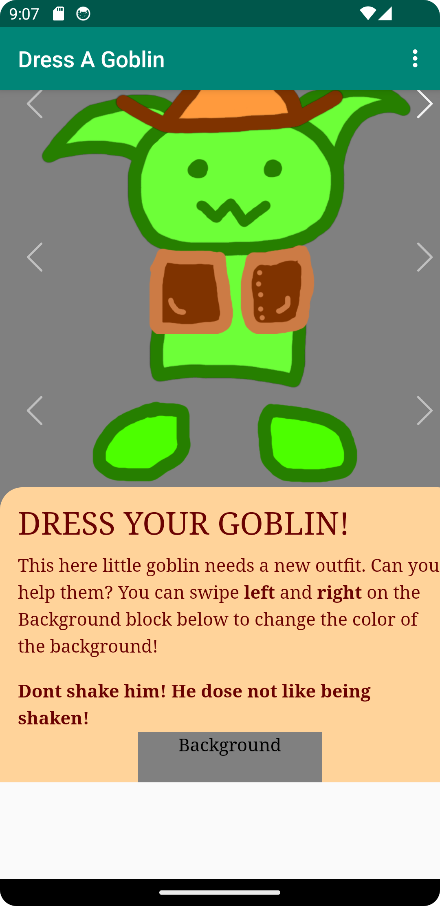
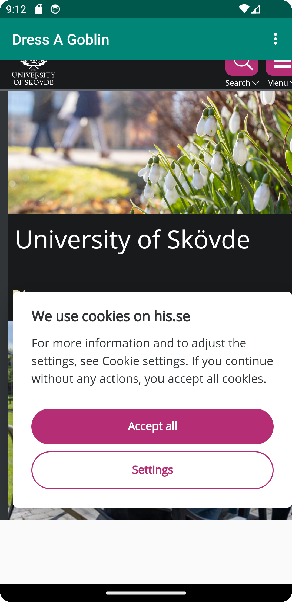

# Rapport

Jag la in en webView istället för textBoxen som redan fanns. Satte på java script på den med hjälp av kod snutten nedan.
```
protected void onCreate(Bundle savedInstanceState){
    ...
        myWebView = findViewById(R.id.my_webview);
        WebSettings webSettings = myWebView.getSettings();
        webSettings.setJavaScriptEnabled(true);
    ...
}
```
Efter det gjorde jag så att om du klickar på den externa webbsidan alternativet vissar den Högskolan i skövdes egna sida och om jag klickar på internal web så vissas min fina goblin sida som jag skapade i mobilapp desgin kursen.
```
    if (id == R.id.action_external_web) {
        myWebView.loadUrl("https://www.his.se/en");
        return true;
    }

    if (id == R.id.action_internal_web) {
        myWebView.loadUrl("file:///android_asset/index.html");
        return true;
    }
```

# Internal Web

# External Web
